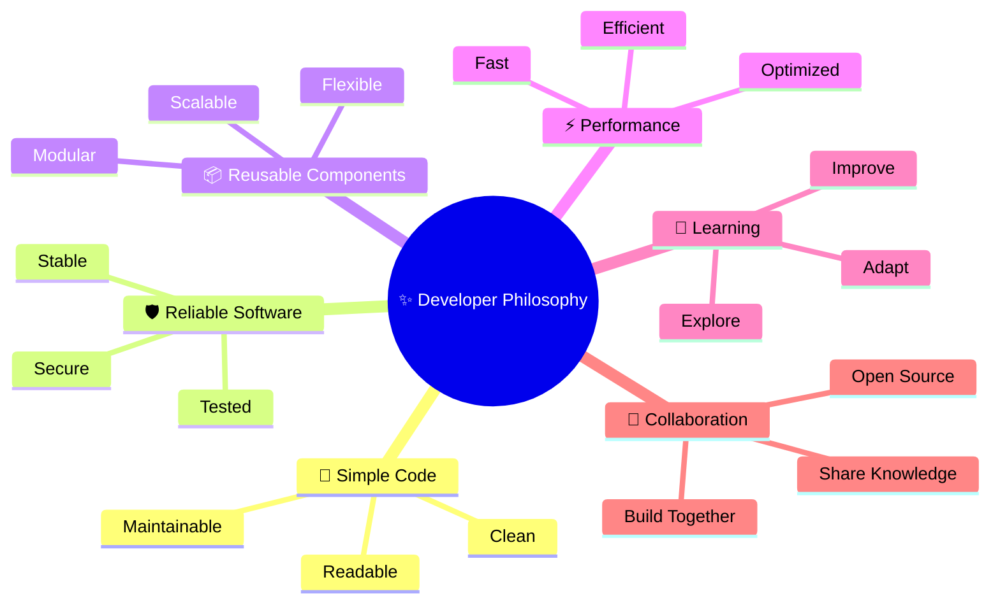

<div align="center">

# Tina-1300

### Software Engineer • Full Stack Developer

Building software with a focus on **performance**, **maintainability** and **developer experience**.

<p>
  
</p>

</div>

</td>

<td width="250" align="center" valign="top">


</td>

</tr>
</table>

<br>

---


## Overview


Programming is more than writing code.

It's about designing solutions, creating reusable tools and constantly improving the way software is built.

I enjoy working on projects from the first idea to the final release, whether it's a library, a backend service, a desktop application or a complete full-stack platform.

<br>

<table>
<tr>

<td width="50%" valign="top">

### Currently Building

- Open Source libraries
- Desktop Application
- Web Application

</td>

<td width="50%" valign="top">

### Interests

- Software Engineering
- Backend Development
- A Little Frontend Developement
- Systems Programming
- Clean Architecture & Clean Code 
- Performance Optimization
- Developer Experience

</td>

</tr>
</table>

---

# Tech Stack

<div align="center">

### Languages


<br><br>

### Backend & Database


<br><br>

### Tools


</div>

---




---

# Open Source

Open source is more than writing code it's about sharing knowledge, collaborating with developers around the world, and helping build software that anyone can learn from, improve, and use.

Contributing to existing projects is an opportunity to give back to the community, solve real-world problems, and continuously grow as a developer. Every contribution, whether it's fixing a bug, improving performance, refining documentation, or introducing a new feature, helps make the ecosystem stronger for everyone.

I believe that the best software is built together, and I'm proud to be part of that journey.

- [https://github.com/laravel/framework/pull/57621](https://github.com/laravel/framework/pull/57621)
- [https://github.com/rwf2/Rocket/pull/2986](https://github.com/rwf2/Rocket/pull/2986)
- [https://github.com/bilyayeva/stl-from-scratch](https://github.com/bilyayeva/stl-from-scratch)

---

# Current Mindset

```C
class Developer{
    public:
        void Learn();
        void Create();
        void Improve();
};

int main(){
    Developer tina;
    while (true){
        tina.Learn();
        tina.Create();
        tina.Improve();
    }
}
```

---

<div align="center">

### "Build something today that you'll still be proud of tomorrow."

</div>
